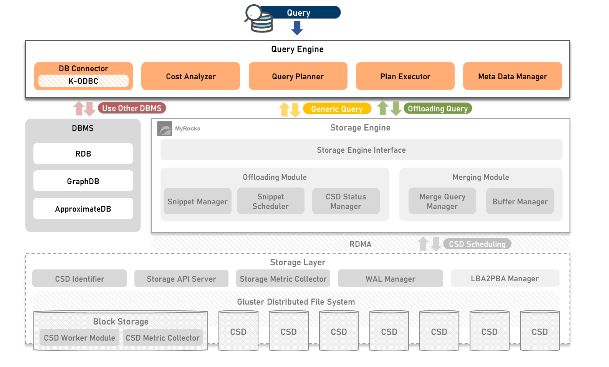

## Introduction of OpenCSD KETI-Query-Engine-Instance
-------------

KETI-Query-Engine-Instance analyzes queries and generates snippets to pushdown queries to CSD.

Depending on the entered query, OpenSourceDB, Generic Query, and Offloading Query are distinguished. The decision between Generic Query and Offloading Query is performed through query execution cost analysis based on query syntax analysis, and the cost is analyzed in Cost Analyzer, and the execution plan of the offloading query is created in Query Planner and executed in Query Executor.

Developed by KETI




## Contents
-------------
[1. Requirement](#requirement)

[2. How To Install](#how-to-install)

[3. Modules](#modules)

[4. Governance](#governance)

## Requirement
>   gcc-11

>   g++-11

>   gRPC

>   cpprestSDK

>   RapidJSON

>   ODBC


## How To Install
1. Install gcc-11 & g++-11
```bash
add-apt-repository ppa:ubuntu-toolchain-r/test
apt-get update
apt-get install gcc-11 g++-11
ln /usr/bin/gcc-11 /usr/bin/gcc
ln /usr/bin/g++-11 /usr/bin/g++
```

2. Install gRPC
```bash
apt install -y cmake
apt install -y build-essential autoconf libtool pkg-config
git clone --recurse-submodules -b v1.46.3 --depth 1 --shallow-submodules https://github.com/grpc/grpc
cd grpc
mkdir -p cmake/build
cd cmake/build
cmake -DgRPC_INSTALL=ON \
      -DgRPC_BUILD_TESTS=OFF \
      -DCMAKE_INSTALL_PREFIX=$MY_INSTALL_DIR \
      ../..
make –j
make install
cd ../..
```

3. Install cpprestSDK
```bash
apt-get install libcpprest-dev
```

4. Install RapidJSON
```bash
apt-get install -y rapidjson-dev
```

5. Install ODBC
```bash
wget http://www.unixodbc.org/unixODBC-2.3.7.tar.gz
tar xvzf unixODBC-2.3.7.tar.gz
cd unixODBC-2.3.7/
./configure --prefix=/
make -j
make install
```

6. Clone KETI-Query-Engine-Instance
```bash
git clone https://github.com/opencsd/KETI-Query-Engine-Instance
cd KETI-Query-Engine-Instance/cmake/build/
```

7. Build
```bash
cmake ../..
make -j
```

8. Run Query-Engine-Instance
```bash
./query-engine-instance
```

## gRPC Protobuf
### Snippet
```protobuf
message Snippet {
    SnippetType type = 1;
    int32 query_id = 2;
    int32 work_id = 3;
    QueryInfo query_info = 4;
    SchemaInfo schema_info = 5;
    repeated SstInfo sst_info = 6;
    WalInfo wal_info = 7;
    ResultInfo result_info = 8;
}
```

### Snippet Type
```protobuf
enum SnippetType {
    FULL_SCAN = 0;
    INDEX_SCAN = 1;
    INDEX_TABLE_SCAN = 2;
    AGGREGATION = 3;
    FILTER = 4;
    INNER_JOIN = 5;
    LEFT_OUTER_JOIN = 6;
    RIGHT_OUTER_JOIN = 7;
    CROSS_JOIN = 8;
    UNION = 9;
    IN = 10;
    EXIST = 11;
    DEPENDENCY_INNER_JOIN = 12;
    DEPENDENCY_EXIST = 13;
    DEPENDENCY_IN = 14;
    TMAX_SNIPPET = 15;
  }
```

## Modules

### Cost Analyzer
- Analyzes the execution cost of the input query and determines whether it is a generic query or an offloading query.

### Query Planner
- Create an execution plan by analyzing the offloaded query in detail. 
- Create a snippet that specifies the work to be performed by dividing the work unit of the query.

### Plan Executor
- Performs the execution plan generated by the Query Planner
- Pushdown Query : Send Snippet to Storage Engine Interface
- Generic Query : Sends Query to DBMS Query Engine through K-ODBC

### Meta Data Manager
- Manage Meta Data such as table data's structure, type, schema
- Synchronizes with the Table Manager of the Storage Engine Instance

## Governance
-------------
This work was supported by Institute of Information & communications Technology Planning & Evaluation (IITP) grant funded by the Korea government(MSIT) (No.2021-0-00862, Development of DBMS storage engine technology to minimize massive data movement)
